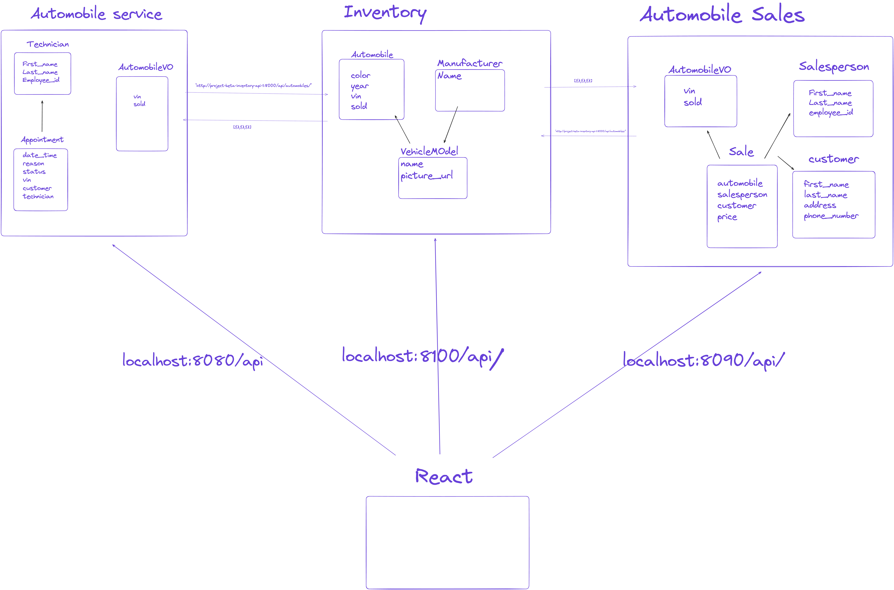

# CarCar

CarCar is an application for managing the aspects of an automobile dealership. It manages the inventory, automobile sales, and automobile services.

Team:

* Abrahim Abdulkader - Auto Sales
* Amir Joshi - Auto Services

## Getting Started

## How to Run this App
 - Put instructions to build and run this app here

**Make sure you have Docker, Git, and Node.js 18.2 or above**

1. Fork this repository

2. Clone the forked repository onto your local computer:
git clone > https://gitlab.com/abrahimabdulkader3/project-beta

3. Build and run the project using Docker with these commands:
```
docker volume create beta-data
docker-compose build
docker-compose up
```
- After running these commands, make sure all of your Docker containers are running

- View the project in the browser: http://localhost:3000/


## Design
CarCar is made up of 3 microservices which interact with one another.

- **Inventory**
- **Services**
- **Sales**




## Integration - How we put the "team" in "team"

Our Inventory and Sales domains work together with our Service domain to make everything here at **CarCar** possible.

How this all starts is at our inventory domain. We keep a record of automobiles on our lot that are available to buy. Our sales and service microservices obtain information from the inventory domain, using a **poller**, which talks to the inventory domain to keep track of which vehicles we have in our inventory so that the service and sales team always has up-to-date information.


## Accessing Endpoints to Send and View Data: Access Through Insomnia & Your Browser

### Manufacturers:


| Action | Method | URL
| ----------- | ----------- | ----------- |
| List manufacturers | GET | http://localhost:8100/api/manufacturers/
| Create a manufacturer | POST | http://localhost:8100/api/manufacturers/ |
| Get a specific manufacturer | GET | http://localhost:8100/api/manufacturers/id/
| Update a specific manufacturer | PUT | http://localhost:8100/api/manufacturers/id/
| Delete a specific manufacturer | DELETE | http://localhost:8100/api/manufacturers/id/


JSON body to send data:

Create and Update a manufacturer (SEND THIS JSON BODY):
- You cannot make two manufacturers with the same name
```
{
  "name": "Chrysler"
}
```
The return value of creating, viewing, updating a single manufacturer:
```
{
	"href": "/api/manufacturers/2/",
	"id": 2,
	"name": "Chrysler"
}
```
Getting a list of manufacturers return value:
```
{
  "manufacturers": [
    {
      "href": "/api/manufacturers/1/",
      "id": 1,
      "name": "Daimler-Chrysler"
    }
  ]
}
```

### Vehicle Models:

| Action | Method | URL
| ----------- | ----------- | ----------- |
| List vehicle models | GET | http://localhost:8100/api/models/
| Create a vehicle model | POST | http://localhost:8100/api/models/
| Get a specific vehicle model | GET | http://localhost:8100/api/models/id/
| Update a specific vehicle model | PUT | http://localhost:8100/api/models/id/
| Delete a specific vehicle model | DELETE | http://localhost:8100/api/models/id/

Create and update a vehicle model (SEND THIS JSON BODY):
```
{
  "name": "Sebring",
  "picture_url": "image.yourpictureurl.com"
  "manufacturer_id": 1
}
```

Updating a vehicle model can take the name and/or picture URL:
```
{
  "name": "Sebring",
  "picture_url": "image.yourpictureurl.com"
}
```
Return value of creating or updating a vehicle model:
- This returns the manufacturer's information as well
```
{
  "href": "/api/models/1/",
  "id": 1,
  "name": "Sebring",
  "picture_url": "image.yourpictureurl.com",
  "manufacturer": {
    "href": "/api/manufacturers/1/",
    "id": 1,
    "name": "Daimler-Chrysler"
  }
}
```
Getting a List of Vehicle Models Return Value:
```
{
  "models": [
    {
      "href": "/api/models/1/",
      "id": 1,
      "name": "Sebring",
      "picture_url": "image.yourpictureurl.com",
      "manufacturer": {
        "href": "/api/manufacturers/1/",
        "id": 1,
        "name": "Daimler-Chrysler"
      }
    }
  ]
}
```

### Automobiles:
- The **'vin'** at the end of the detail urls represents the VIN for the specific automobile you want to access. This is not an integer ID. This is a string value so you can use numbers and/or letters.

| Action | Method | URL
| ----------- | ----------- | ----------- |
| List automobiles | GET | http://localhost:8100/api/automobiles/
| Create an automobile | POST | http://localhost:8100/api/automobiles/
| Get a specific automobile | GET | http://localhost:8100/api/automobiles/vin/
| Update a specific automobile | PUT | http://localhost:8100/api/automobiles/vin/
| Delete a specific automobile | DELETE | http://localhost:8100/api/automobiles/vin/


Create an automobile (SEND THIS JSON BODY):
- You cannot make two automobiles with the same vin
```
{
  "color": "red",
  "year": 2012,
  "vin": "1C3CC5FB2AN120174",
  "model_id": 1
}
```
Return Value of Creating an Automobile:
```
{
	"href": "/api/automobiles/1C3CC5FB2AN120174/",
	"id": 1,
	"color": "red",
	"year": 2012,
	"vin": "777",
	"model": {
		"href": "/api/models/1/",
		"id": 1,
		"name": "R8",
		"picture_url": "image.yourpictureurl.com",
		"manufacturer": {
			"href": "/api/manufacturers/1/",
			"id": 1,
			"name": "Audi"
		}
	}
}
```
To get the details of a specific automobile, you can query by its VIN:
example url: http://localhost:8100/api/automobiles/1C3CC5FB2AN120174/

Return Value:
```
{
  "href": "/api/automobiles/1C3CC5FB2AN120174/",
  "id": 1,
  "color": "green",
  "year": 2011,
  "vin": "1C3CC5FB2AN120174",
  "model": {
    "href": "/api/models/1/",
    "id": 1,
    "name": "Sebring",
    "picture_url": "image.yourpictureurl.com",
    "manufacturer": {
      "href": "/api/manufacturers/1/",
      "id": 1,
      "name": "Daimler-Chrysler"
    }
  }
}
```
You can update the color and/or year of an automobile (SEND THIS JSON BODY):
```
{
  "color": "red",
  "year": 2012
}
```
Getting a list of Automobile Return Value:
```
{
  "autos": [
    {
      "href": "/api/automobiles/1C3CC5FB2AN120174/",
      "id": 1,
      "color": "yellow",
      "year": 2013,
      "vin": "1C3CC5FB2AN120174",
      "model": {
        "href": "/api/models/1/",
        "id": 1,
        "name": "Sebring",
        "picture_url": "image.yourpictureurl.com",
        "manufacturer": {
          "href": "/api/manufacturers/1/",
          "id": 1,
          "name": "Daimler-Chrysler"
        }
      }
    }
  ]
}
```
# Sales Microservice

On the backend, the sales microservice has 4 models: AutomobileVO, Customer, SalesPerson, and SalesRecord. SalesRecord is the model that interacts with the other three models. This model gets data from the three other models.

The AutomobileVO is a value object that gets data about the automobiles in the inventory using a poller. The sales poller automotically polls the inventory microservice for data, so the sales microservice is constantly getting the updated data.

The reason for integration between these two microservices is that when recording a new sale, you'll need to choose which car is being sold and that information lives inside of the inventory microservice.


## Accessing Endpoints to Send and View Data - Access through Insomnia:

### Customers:


| Action | Method | URL
| ----------- | ----------- | ----------- |
| List customers | GET | http://localhost:8090/api/customers/
| Create a customer | POST | http://localhost:8090/api/customers/
| Show a specific customer | GET | http://localhost:8090/api/customers/id/

To create a Customer (SEND THIS JSON BODY):
```
{
	"first_name": "Mohamed",
	"last_name": "Abdulkarim",
	"address": "123 Bowling Street",
	"phone_number": "6462069260"
}
```
Return Value of Creating a Customer:
```
{
	"first_name": "Mohamed",
	"last_name": "Abdulkarim",
	"address": "123 Bowling Street",
	"phone_number": "6462069260"
}
```
Return value of Listing all Customers:
```
[
	{
		"id": 1,
		"first_name": "Abrahim",
		"last_name": "Abdulkader",
		"address": "123 Bowling Street",
		"phone_number": "6462069260"
	},
	{
		"id": 2,
		"first_name": "Abrahim",
		"last_name": "Abdulkader",
		"address": "123 Bowling Street",
		"phone_number": "6462069260"
	},
	{
		"id": 3,
		"first_name": "Abrahim",
		"last_name": "Abdulkader",
		"address": "123 Bowling Street",
		"phone_number": "6462069260"
	},
	{
		"id": 4,
		"first_name": "Abrahim",
		"last_name": "Abdulkader",
		"address": "123 Bowling Street",
		"phone_number": "6462069260"
	},
	{
		"id": 5,
		"first_name": "Mohamed",
		"last_name": "Abdulkarim",
		"address": "123 Bowling Street",
		"phone_number": "6462069260"
	}
]
```
### Salespeople:
| Action | Method | URL
| ----------- | ----------- | ----------- |
| List salespeople | GET | http://localhost:8090/api/salespeople/
| Salesperson details | GET | http://localhost:8090/api/salesperson/id/
| Create a salesperson | POST | http://localhost:8090/api/salespeople/
| Delete a salesperson | DELETE | http://localhost:8090/api/salesperson/id/


To create a salesperson (SEND THIS JSON BODY):
```
{
	"first_name": "Kevin",
	"last_name": "Durant",
	"employee_id": "4"
}
```
Return Value of creating a salesperson:
```
{
	"salesperson": [
		{
			"id": 10,
			"first_name": "Kevin",
			"last_name": "Durant",
			"employee_id": "4"
		}
	]
}
```
List all salespeople Return Value:
```
{
	"salesperson": [
		{
			"id": 10,
			"first_name": "Kevin",
			"last_name": "Durant",
			"employee_id": "4"
		}
	]
}
```
### Salesrecords:
- the id value to show a salesperson's salesrecord is the **"id" value tied to a salesperson.**

| Action | Method | URL
| ----------- | ----------- | ----------- |
| List all salesrecords | GET | http://localhost:8090/api/salesrecords/
| Create a new sale | POST | http://localhost:8090/api/salesrecords/
| Show salesperson's salesrecords | GET | http://localhost:8090/api/salesrecords/id/
List all Salesrecords Return Value:
```
{
	"sales": [
		{
			"id": 1,
			"price": 111000,
			"vin": {
				"vin": "111"
			},
			"salesperson": {
				"id": 1,
				"name": "Liz",
				"employee_number": 1
			},
			"customer": {
				"name": "Martha Stewart",
				"address": "1313 Baker Street",
				"phone_number": "980720890"
			}
		}
	]
}
```
Create a New Sale (SEND THIS JSON BODY):
```
{
	"automobile": "1045NGONCA800613",
	"salesperson": 10,
	"customer": 5,
	"price": "10"

}

```
Return Value of Creating a New Sale:
```
{
	"sales": [
		{
			"id": 23,
			"automobile": {
				"id": 2,
				"vin": "1045NGONCA800613",
				"sold": false
			},
			"salesperson": {
				"id": 10,
				"first_name": "Kevin",
				"last_name": "Durant",
				"employee_id": "4"
			},
			"customer": {
				"id": 5,
				"first_name": "Mohamed",
				"last_name": "Abdulkarim",
				"address": "123 Bowling Street",
				"phone_number": "6462069260"
			},
			"price": 10
		}
	]
}
```
Show a Salesperson's Salesrecord Return Value:
```
{
	"id": 1,
	"price": 111000,
	"vin": {
		"vin": "111"
	},
	"salesperson": {
		"id": 1,
		"name": "Liz",
		"employee_number": 1
	},
	"customer": {
		"id",
		"name": "Martha Stewart",
		"address": "1313 Baker Street",
		"phone_number": "980720890"
	}
}
```
